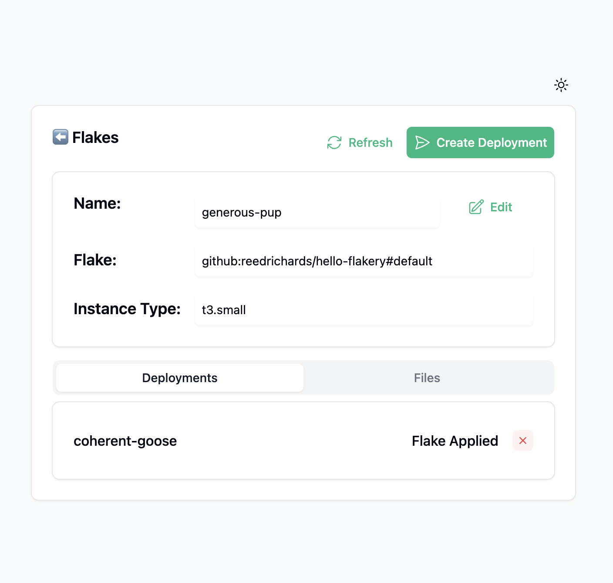
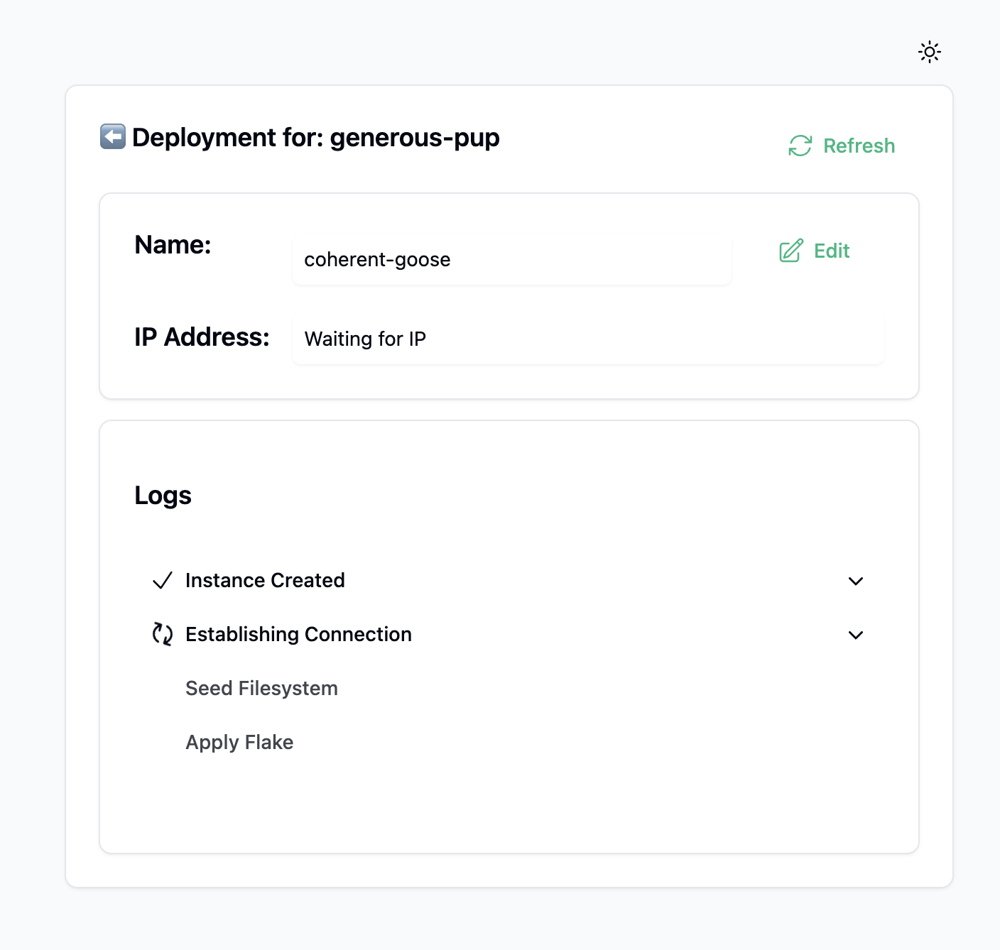
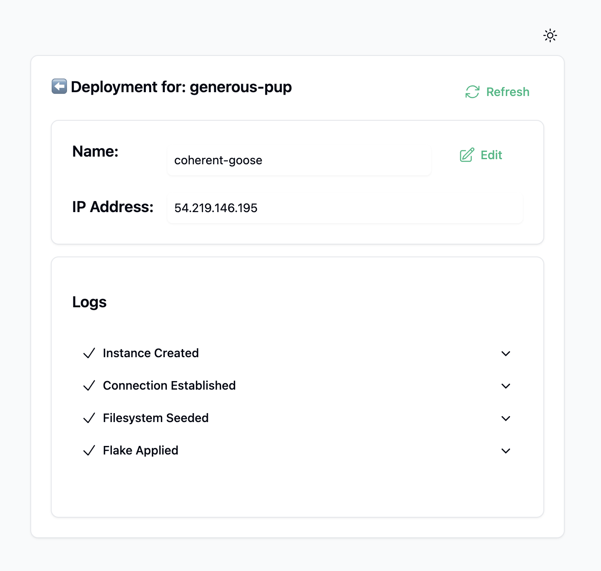

# Introduction

Flakery creates templates and deployments for your nixos flakes. You can use flakery to create deployments of a nixos flake, seeded with a file system. These files are encrypted at rest and can be decrypted on demand. 

## Prerequisites

In order to use flakery, you will need to have the following installed:

- [Nix](https://nixos.org/download.html)
- [Nix Flakes](https://nixos.wiki/wiki/Flakes)
- [OpenSSH](https://www.openssh.com/)
- [Git](https://git-scm.com/)

### Create your project directory and initialize a flake

To create a new flake, you can use the `nix flake init` command. This will create a new directory with a `flake.nix` file and a `hello.nix` file.

```shell
mkdir hello-flakery
cd hello-flakery
nix flake init -t github:getflakery/flakes#default
```

### Add your ssh public key to the flake

If you don't already have an ssh key, you can generate one with the following command:

```shell
ssh-keygen 
```

this will generate a new ssh key in your `~/.ssh` directory. You can then add this key to your flake by editing the `hello.nix` file 

```nix{26,27}
{ config, pkgs, ... }:

{

  # Set your time zone.
  time.timeZone = "America/Los_Angeles";


  system.stateVersion = "23.05"; 
  nix.settings.experimental-features = [ "nix-command" "flakes" ];


  users.users.alice = {
    isNormalUser = true;
    extraGroups = [ "wheel" ]; # Enable ‘sudo’ for the user.
    packages = with pkgs; [ ];
  };
  services.openssh = {
    enable = true;
    # require public key authentication for better security
    settings.PasswordAuthentication = false;
    settings.KbdInteractiveAuthentication = false;
    #settings.PermitRootLogin = "yes";
  };
  users.users."alice".openssh.authorizedKeys.keys = [
    # replace with your ssh key 
    "ssh-ed25519 NOTAREALKEYBUTTHISISWHEREYOURSSHOULDBEdslkfjsoi3cjnefoODIUFNI0JDNCKL+" 
  ];

}
```


### Create a git repository and push your flake

Initialize a git repository and create an initial commit. 

```shell
git init
git add .
git commit -m "initial commit"
```

Create a [new repository on Github](https://github.com/new) and push your flake to the repository. 

```shell
git branch -M main
git remote add origin git@github.com:$YOUR_USERNAME/hello-flakery.git
git push -u origin main
```

::: tip
Replace `$YOUR_USERNAME` with your Github username.
:::

### Deploy your flake on Flakery

#### Create your deployment template 


To deploy your flake on Flakery, you will need to create a new deployment. You can do this by visiting the [Flakery website](https://flakery.dev/flakes) and adding your flake to the input field. the url should look something like this: `github:$YOUR_USERNAME/hello-flakery#default`.

::: tip
Replace `$YOUR_USERNAME` with your Github username.
:::

 


#### Create your deployment

Once you have added your flake, it will appear in the list of available flakes. You can click on the flake to view its details.


Once you have added your flake, you can click the "Create Deployment" button. This will create a new deployment of your flake.


after creating your deployment, you can view the details of your deployment.







After a few minutes, your deployment will be ready. You can then ssh into your deployment using the following command:

```shell
ssh alice@$YOUR_DEPLOYMENT_IP
```
::: tip
Replace `$YOUR_DEPLOYMENT_IP` with the IP address of your deployment.
:::

you should get a terminal session from which you can interact with your deployment. 

```shell
[alice@ip-10-0-0-210:~]$ 
```


 